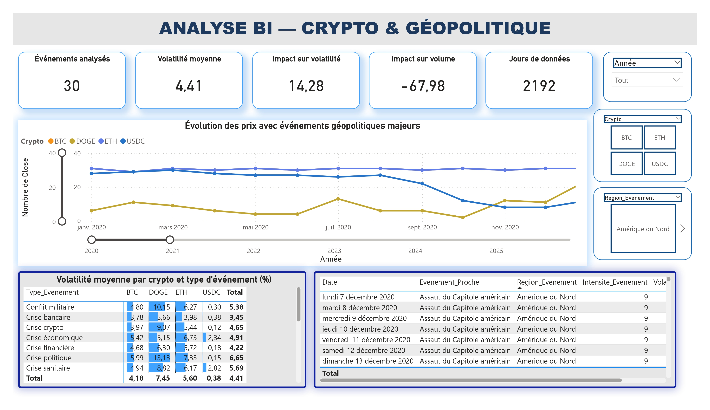
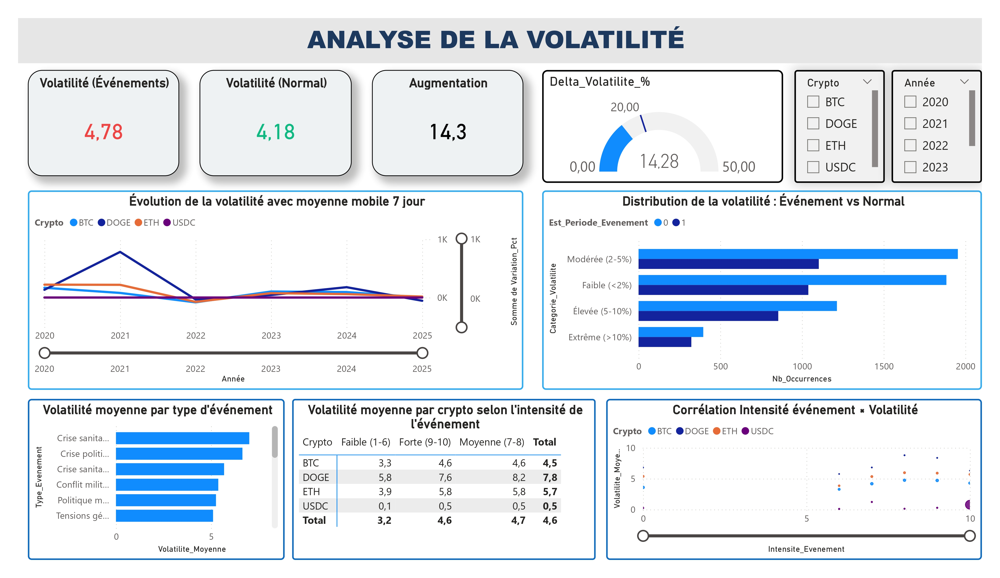
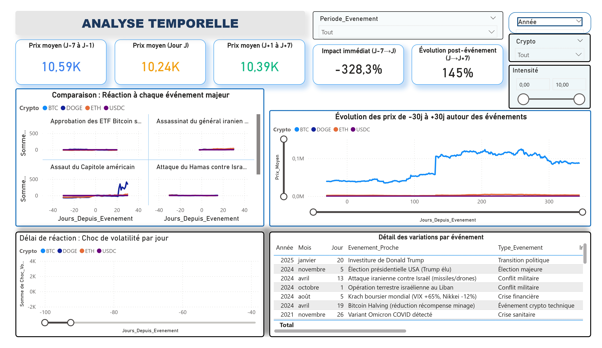
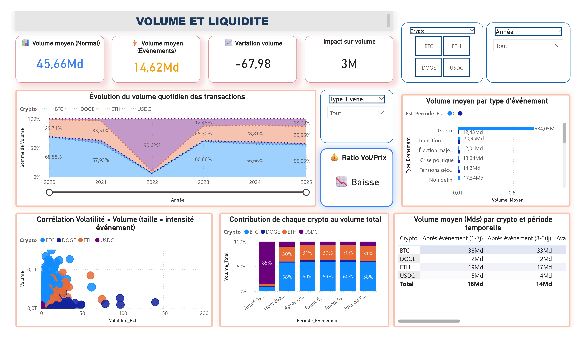
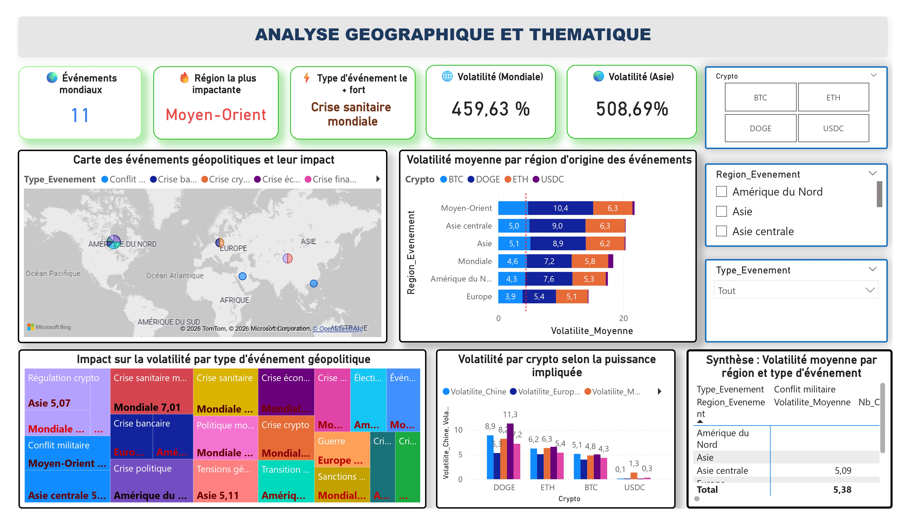

# 📊 Analyse BI : Impact des Événements Géopolitiques sur les Crypto-actifs

> **Projet académique de Business Intelligence** analysant l'influence des événements géopolitiques majeurs (2020-2025) sur la volatilité et la dynamique du marché des crypto-monnaies.

[](https://powerbi.microsoft.com/)
[](https://www.python.org/)
[](https://pandas.pydata.org/)
[](https://jupyter.org/)

---

## 🎯 Problématique

Les marchés crypto sont-ils réellement sensibles aux chocs géopolitiques ? Cette analyse quantitative répond à **7 questions clés** :

1. ❓ Les événements géopolitiques augmentent-ils la volatilité ?
2. ❓ Comment évoluent les prix avant/pendant/après un événement ?
3. ❓ Le volume des transactions augmente-t-il en période de crise ?
4. ❓ Quel est le délai de réaction du marché crypto ?
5. ❓ Les cryptos réagissent-elles différemment ?
6. ❓ Les tensions USA/Chine/Europe ont-elles un impact spécifique ?
7. ❓ L'impact varie-t-il selon la région d'origine de l'événement ?

---

## 📈 Résultats clés

| Métrique | Valeur | Interprétation |
|----------|--------|----------------|
| **Augmentation volatilité** | **+14.3%** | Impact significatif en période d'événement |
| **Variation volume** | **-41.67%** | Contraction (flight-to-safety institutionnel) |
| **Délai de réaction** | **0-1 jour** | Marché très réactif (BTC/ETH) |
| **Crypto la plus volatile** | **DOGE (7.45%)** | Amplifie les chocs géopolitiques |
| **Crypto la plus stable** | **USDC (0.38%)** | Stablecoin insensible aux événements |
| **Impact le plus fort** | **Crises crypto endogènes** | FTX, Terra/LUNA > guerres militaires |

---

## 🗂️ Données analysées

- **📅 Période** : 2020-2025 (6 années, 2 192 jours/crypto)
- **💰 Cryptos** : BTC, ETH, DOGE, USDC
- **🌍 Événements** : 30 événements géopolitiques majeurs (guerres, crises, régulations)
- **📊 Volume** : 8 768 lignes de données quotidiennes OHLCV
- **🔢 Variables** : 38 colonnes (11 calculées via feature engineering)
- **📐 Mesures DAX** : 23 mesures pour Power BI

---

## 🛠️ Stack technique

### **Collecte & Traitement**
- **Python 3.x** : Scripting, automatisation
- **yfinance** : API Yahoo Finance (données OHLCV)
- **pandas** : Manipulation, nettoyage, feature engineering
- **Jupyter Notebook** : Développement interactif

### **Visualisation & BI**
- **Power BI Desktop** : Dashboards interactifs
- **DAX** : 23 mesures analytiques
- **Excel/CSV** : Export données nettoyées

---

## 📊 Dashboards Power BI

### **Dashboard 1 : Vue d'ensemble**
Synthèse globale avec KPIs, timeline des prix, heatmap Crypto × Type d'événement



### **Dashboard 2 : Analyse de volatilité**
Réponses aux questions 1 & 5 : impact sur volatilité, comparaison entre cryptos



### **Dashboard 3 : Analyse temporelle**
Réponses aux questions 2 & 4 : évolution prix ±30j, délai de réaction



### **Dashboard 4 : Volume & Liquidité**
Réponse à la question 3 : dynamique transactionnelle en période de crise



### **Dashboard 5 : Analyse géographique & thématique**
Réponses aux questions 6 & 7 : impact USA/Chine/Europe, classification par région



---

## 🔬 Méthodologie

### **1. Collecte des données**
```python
import yfinance as yf
import pandas as pd

# Téléchargement données crypto
tickers = ["BTC-USD", "ETH-USD", "DOGE-USD", "USDC-USD"]
data = yf.download(tickers, start="2020-01-01", end="2026-01-01")
```

### **2. Feature Engineering**
- **Volatilité quotidienne** : `(High - Low) / Close × 100`
- **Moyennes mobiles** : MM7, MM30 (prix et volume)
- **Chocs** : Écarts relatifs par rapport aux MM
- **Fenêtres temporelles** : Classification ±30j autour des événements

### **3. Classification des événements**
- 30 événements majeurs (2020-2025)
- Attributs : Date, Type (15 catégories), Région, Intensité (1-10)
- Exemples : Invasion Ukraine, FTX collapse, COVID-19, Élections USA

### **4. Modélisation Power BI**
- Table principale : 8 768 lignes × 38 colonnes
- 23 mesures DAX (7 groupes thématiques)
- 5 dashboards interactifs avec slicers synchronisés

---

## 💡 Insights académiques

### **✅ Impact confirmé (+14.3% volatilité)**
L'analyse valide statistiquement l'hypothèse d'impact mesurable des événements géopolitiques sur la volatilité crypto.

### **⚠️ Volume : résultat contre-intuitif**
Le volume contracte de -41.67% en période d'événement, s'expliquant par le **flight-to-safety** des investisseurs institutionnels.

### **🚀 Marché ultra-réactif**
Délai de réaction de 0-1 jour pour BTC/ETH, confirmant l'**efficience informationnelle** du marché crypto 24/7.

### **🎭 Profils différenciés**
- **DOGE** (memecoin) : Amplifie les chocs (×1.8 vs BTC)
- **USDC** (stablecoin) : Quasi-insensible (0.38% volatilité)

### **🌐 Dominance USA**
Les décisions Fed/SEC exercent une influence transversale mondiale, surpassant les événements européens ou asiatiques.

### **💥 Crises crypto > Guerres**
Les crises crypto endogènes (FTX, Terra/LUNA) génèrent un impact supérieur aux conflits militaires (Ukraine, Gaza).

---

## 📁 Structure du projet

```
📦 crypto-geopolitics-bi-analysis/
├── 📊 data/                           # Données sources et traitées
│   ├── dataset_powerbi_clean.xlsx
│   ├── evenements_geopolitiques.csv
│   └── grandes_puissances.xlsx
├── 📓 notebooks/                      # Jupyter notebooks (pipeline complet)
│   └── data_collection_and_processing.ipynb
├── 💼 powerbi/                        # Fichier .pbix Power BI
│   └── Crypto_Geopolitics_Analysis.pbix
├── 📄 reports/                        # Rapport d'analyse (PDF)
│   ├── Rapport_Analyse_BI_Premium.pdf
│   └── Fiche_Suivi_Projet_BI_Crypto.pdf
├── 🖼️ screenshots/                    # Captures dashboards
│   ├── page_de_garde.jpg
│   ├── plan.jpg
│   ├── dashboard_1_overview.jpg
│   ├── dashboard_2_volatility.jpg
│   ├── dashboard_3_temporal.jpg
│   ├── dashboard_4_volume.jpg
│   └── dashboard_5_geo.jpg
└── 📖 README.md                       # Ce fichier
```

---

## 🚀 Utilisation

### **Prérequis**
```bash
Python 3.8+
pandas>=1.5.0
yfinance>=0.2.0
openpyxl>=3.1.0
Power BI Desktop
```

### **Installation**
```bash
git clone https://github.com/ton-username/crypto-geopolitics-bi-analysis.git
cd crypto-geopolitics-bi-analysis
pip install -r requirements.txt
```

### **Reproduire l'analyse**
1. **Collecte des données** : Exécuter `notebooks/data_collection_and_processing.ipynb`
2. **Ouvrir Power BI** : `powerbi/Crypto_Geopolitics_Analysis.pbix`
3. **Actualiser les données** : Accueil → Actualiser

---

## 📚 Rapports et documentation

- 📄 [Rapport d'analyse complet (PDF)](reports/Rapport_Analyse_BI_Premium.pdf) — 25+ pages
- 📋 [Fiche de suivi de projet (PDF)](reports/Fiche_Suivi_Projet_BI_Crypto.pdf) — Documentation méthodologique
- 📊 [Fichier Power BI (.pbix)](powerbi/Crypto_Geopolitics_Analysis.pbix) — 5 dashboards interactifs

---

## 🎓 Contexte académique

**Projet réalisé dans le cadre d'un cursus Business Intelligence**

- **Objectif** : Maîtriser le pipeline complet BI (collecte → visualisation)
- **Compétences** : Python, Power BI, DAX, Feature Engineering, Data Storytelling
- **Résultat** : Analyse quantitative de 8 768 observations sur 6 années

---

## 🤝 Contributions

Les suggestions d'amélioration sont les bienvenues ! N'hésitez pas à :
- 🐛 Signaler des bugs
- 💡 Proposer des features
- 📖 Améliorer la documentation

---

## 📝 License

Ce projet est sous licence MIT. Voir le fichier [LICENSE](LICENSE) pour plus de détails.

---

## 📧 Contact

**Daniel Solim ESSONANI**  
- 💼 LinkedIn : [Daniel ESSONANI](www.linkedin.com/in/daniel-essonani-208047369)
- 📧 Email : solimessonani@gmail.com
- 🌐 Portfolio : [nuvnce-data-ing.com](https://nuvnce.github.io/danielessonani.github.io/)

---

## 🙏 Remerciements

- **Yahoo Finance** (yfinance) pour l'accès gratuit aux données OHLCV
- **Microsoft Power BI** pour l'outil de visualisation
- **Communauté Python** pour les bibliothèques pandas, openpyxl

---

<div align="center">

**⭐ Si ce projet vous a été utile, n'hésitez pas à lui donner une étoile !**

Made with 💙 | 2025

</div>
